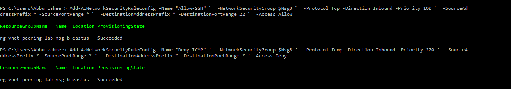
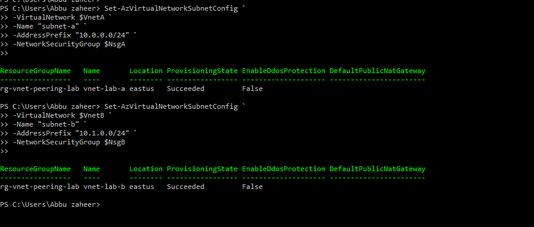

# Lab 5: Azure VNet Peering with NSG Rules

## 🎯 Objective
Configure and validate Network Security Groups (NSGs) in peered VNets to enforce traffic policies.  
Specifically, allow SSH connectivity while denying ICMP (ping) traffic between VMs.

## ⚙️ Resources Deployed
| Resource Type | Name | Purpose |
|---|---|---|
| Resource Group | rg-vnet-peering-lab | Logical container for networking resources |
| Virtual Network A | vnet-lab-a | Primary virtual network |
| Virtual Network B | vnet-lab-b | Secondary virtual network |
| Subnet A | subnet-a | Subnet associated with NSG-A |
| Subnet B | subnet-b | Subnet associated with NSG-B |
| Network Security Group A | nsg-a | Controls inbound traffic for subnet-a |
| Network Security Group B | nsg-b | Controls inbound traffic for subnet-b |
| Virtual Machine 1 | Vm01 | Ubuntu Linux VM used for SSH and connectivity validation |
| Virtual Machine 2 | Vm02 | Ubuntu Linux VM used for ICMP validation |

## Deployment Scope
This lab focused on configuring Azure Network Security Groups (NSGs) within peered VNets to control network traffic using inbound security rules. Connectivity validation was performed using SSH and ICMP testing between Ubuntu virtual machines.

## 📸 Screenshots

**NSG Deployment**  
Provisioned Network Security Groups for both virtual networks using Azrue PowerShell.

**NSG Rule Configuration for NSG-A**  
Configured inbound security rules to allow SSH traffic and deny ICMP traffic.

**NSG Rule Configuration for NSG-B**  
Configured inbound security rules to allow SSH traffic and deny ICMP traffic.

**Subnet Association**  
Associated Network Security Groups with their respective subnets.

**SSH Connectivity Validation**  
Validated successful SSH connectivity to Vm01 through the configured NSG rules.

**ICMP Traffic Restricition Validation**  
Verified ICMP traffic restriction between virtual machines using ping testing.

## Operational Validation
 
- Verified successful deployment of Network Security Groups in both VNets.
- Confirmed subnet association with respective NSGs.
- Validated SSH connectivity between virtual machines.
- Confirmed ICMP traffic blocking through Deny-ICMP NSG rules.
- Verified traffic filtering behavior using Linux networking commands.

## Troubleshooting and Observations
| Scenario | Observation | Resolution |
|---|---|---|
| SSH connectivity test | SSH access succeeded between virtual machines | NSG allow rule for TCP port 22 validated successfully |
| ICMP connectivity test | Ping requests failed with 100% packet loss | Deny-ICMP rule enforcement confirmed successfully |

## 📚 Key Learnings
- Configured Azure Network Security Groups using Azure PowerShell.
- Implemented inbound security rules to control SSH and ICMP traffic.
- Associated NSGs with Azure subnets for traffic filtering.
- Validated network connectivity using SSH and Linux networking commands.
- Improved understanding of Azure network security policy enforcement.

## 📌 Resume Alignment
- Configured Azure Network Security Groups and subnet associations using Azure PowerShell.
- Implemented inbound security policies to allow SSH access while blocking ICMP traffic.
- Validated network traffic enforcement across peered Azure VNets using Linux connectivity testing.
- Demonstrated Azure network segmentation and traffic control implementation.
