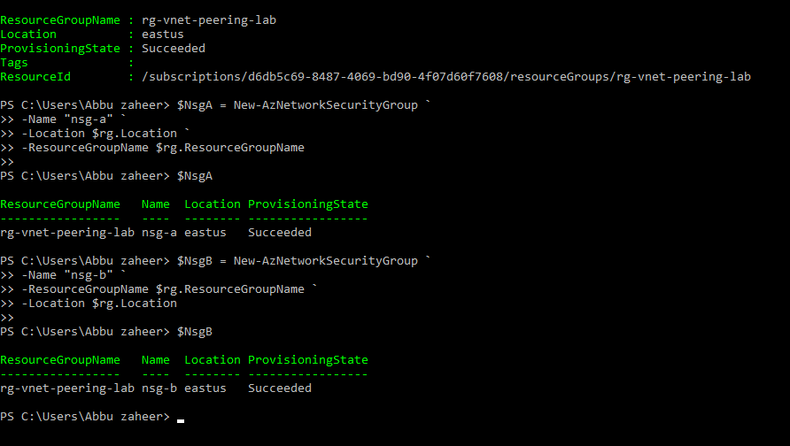
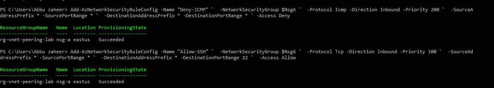
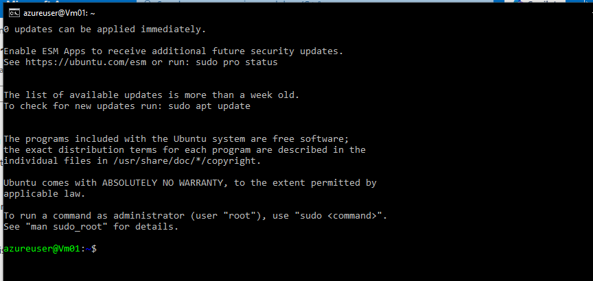
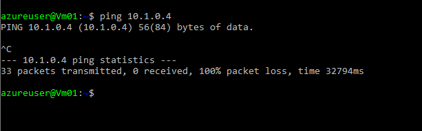

# Lab 5: Azure VNet Peering with NSG Rules

## 🎯 Objective
Configure and validate Network Security Groups (NSGs) in peered VNets to enforce traffic policies.  
Specifically, allow SSH connectivity while denying ICMP (ping) traffic between VMs.

## ⚙️ Resources Deployed
- Resource Group: rg-vnet-peering-lab
- Virtual Networks: vnet-lab-a, vnet-lab-b
- Subnets: subnet-a, subnet-b
- NSGs: nsg-a, nsg-b
- VMs: Vm01, Vm02 (Ubuntu Linux)

## 📸 Screenshots

**NSG Creation**  
Successfully created two NSGs (`nsg-a` and `nsg-b`) in the resource group.  

**NSG Rule Configuration (nsg-a)**  
Added inbound rules:  
- Allow-SSH (TCP/22, Priority 100)  
- Deny-ICMP (Priority 200)  

**NSG Rule Configuration (nsg-b)**  
Added inbound rules:  
- Allow-SSH (TCP/22, Priority 100)  
- Deny-ICMP (Priority 200)  

**Subnet Configuration**  
Attached NSGs to their respective subnets in `vnet-lab-a` and `vnet-lab-b`.  

**SSH Connection to Vm01**  
Successfully connected to Vm01 via SSH as per the NSG allow rule.  

**Ping Test to Vm02**  
Ping from Vm01 to Vm02 failed with 100% packet loss, confirming Deny-ICMP rule enforcement.  

---

## 📚 Key Learnings
- How to create and configure NSGs with PowerShell.  
- How to apply rules to control traffic (Allow-SSH, Deny-ICMP).  
- How to attach NSGs to subnets in VNets.  
- How to validate connectivity across peered VNets using SSH and ping tests.  

## 📌 Resume Bullets
- Configured Azure VNets with NSGs to enforce traffic policies.  
- Implemented rules to allow SSH while blocking ICMP traffic.  
- Validated connectivity across peered VNets using PowerShell and Linux commands.  
